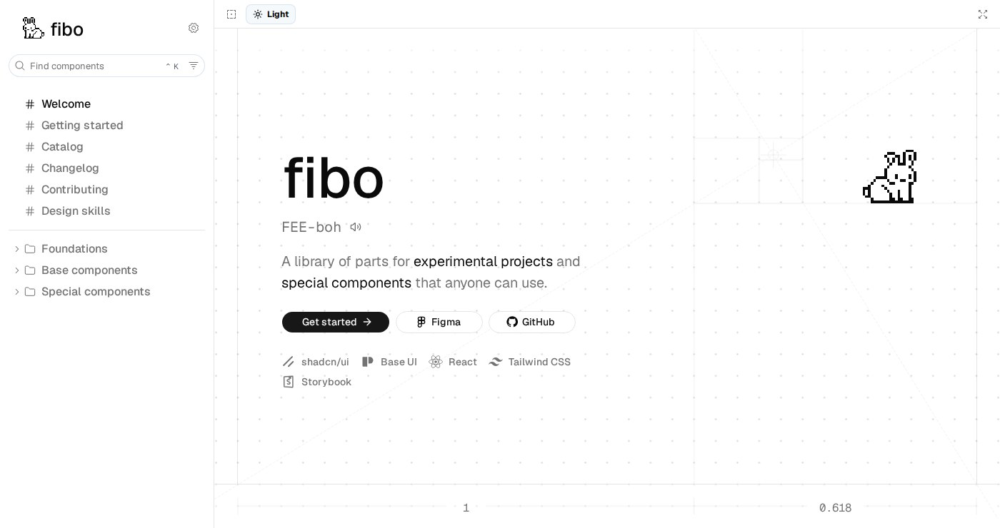

# fibo

A library of parts for experimental projects and special components.

fibo is an achromatic design system built on [shadcn/ui](https://ui.shadcn.com)
and [Base UI](https://base-ui.com). Every part is documented in Storybook and
installs from a shadcn registry, so it copies into your project as source,
follows your tokens, and belongs to you.

[](https://github.com/toribryan/fibo/actions/workflows/ci.yml)
[](./LICENSE)
[](https://fibo.toribryan.com)

[Docs](https://fibo.toribryan.com) ·
[Figma library](https://www.figma.com/design/LJZ5Tt4Ba7NPPi8Xnq8i0e/Fibo-DS) ·
[llms.txt](https://fibo.toribryan.com/llms.txt)



## Install

Add the registry to your project's `components.json` once:

```json
{
  "registries": {
    "@fibo": "https://fibo.toribryan.com/r/{name}.json"
  }
}
```

Then add any part by name. Anything it depends on comes with it:

```bash
pnpm dlx shadcn@latest add @fibo/button
```

Without the registry entry, the full URL works in any shadcn project:

```bash
pnpm dlx shadcn@latest add https://fibo.toribryan.com/r/button.json
```

To make the parts look the way they do in Storybook, copy the `:root` and
`.dark` blocks from [`globals.css`](./packages/ui/src/styles/globals.css) into
your own.

## What's inside

**Base components** are the standard set. They depend on nothing beyond Base UI,
`class-variance-authority` and `lucide-react`.

| Part     | What it does                                                |
| -------- | ----------------------------------------------------------- |
| Badge    | A short label for status, category or count.                |
| Button   | Triggers an action or event with a single click.            |
| Checkbox | Turns a single option on or off, or picks many from a list. |
| Input    | A single line of free text.                                 |
| Label    | Names a form control and widens its hit area.               |
| Textarea | Several lines of free text that grow with the content.      |

**Special components** are playful and built for one kind of moment. They may bring
`motion` with them.

| Part               | What it does                                                           |
| ------------------ | ---------------------------------------------------------------------- |
| Chapter scrubber   | A rail of marks that swell under the pointer, previewing each chapter. |
| Integration visual | A hub and the tools wired into it, with pulses along the routes.       |
| Reactions          | Lets people respond to content with an emoji in one tap.               |
| Token flow         | Walks a colour token from raw value to primitive to semantic role.     |

Every part has a docs page in [Storybook](https://fibo.toribryan.com) with
its features, a usage example, the parts it renders, guidelines, do's and
don'ts, a props and data attributes reference, and accessibility notes.

## Principles

- **Achromatic by default.** There is no brand hue. `primary` is a neutral and
  colour only ever carries meaning: destructive, success, warning, info.
- **One name on both sides.** Every token in `globals.css` matches a Figma
  variable. Opacity steps get names too (`-subtle`, `-hover`, `-ring`), so a
  designer can bind them.
- **Yours once installed.** Installing a part copies its source into your
  project, where you can change it like any other file.
- **Contrast is measured.** Status tones sit on the 700 step so text clears
  WCAG AA on solid fills and on their tints, in both themes.

## Using fibo with coding agents

- [`llms.txt`](https://fibo.toribryan.com/llms.txt) lists every part with its
  install command, and says the list is complete.
- With `@fibo` in your `components.json`, the
  [shadcn MCP server](https://ui.shadcn.com/docs/mcp) can browse and install
  fibo parts.
- Working in this repo, agents read [`AGENTS.md`](./AGENTS.md) and can use the
  `add-component` skill and the `component-reviewer` subagent that ship with it.

## Development

Requires Node 24 (pinned in `.nvmrc`) and pnpm.

```bash
pnpm install
pnpm storybook
```

Storybook runs at http://localhost:6006.

| Script                | What it does                                          |
| --------------------- | ----------------------------------------------------- |
| `pnpm storybook`      | Storybook                                             |
| `pnpm dev`            | Every app in dev mode                                 |
| `pnpm build`          | Build the registry and Storybook                      |
| `pnpm build:site`     | Build, then assemble the deployable site in `dist/`   |
| `pnpm registry:build` | Regenerate the registry JSON and `llms.txt`           |
| `pnpm lint`           | ESLint, zero warnings allowed                         |
| `pnpm typecheck`      | TypeScript in every workspace                         |
| `pnpm test`           | Unit, interaction and accessibility tests in Chromium |
| `pnpm format:write`   | Prettier                                              |

CI runs format, lint, build, typecheck and tests on every pull request, and
Chromatic checks every story for visual changes. The repo
layout and the registry build are described in [`AGENTS.md`](./AGENTS.md).

## Contributing

Issues and pull requests are welcome. Start with
[CONTRIBUTING.md](./CONTRIBUTING.md).

## License

[MIT](./LICENSE) © Tori Bryan
